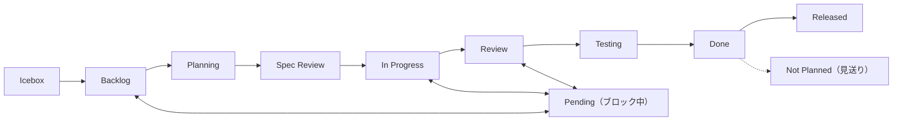

# プロジェクトアイテムルール

## 必須フィールド

| フィールド | 必須 | オプション |
|-----------|------|-----------|
| Status | はい | 下記ワークフロー参照 |
| Priority | はい | Critical / High / Medium / Low |
| Size | 推奨 | XS / S / M / L / XL |
| Type | はい | Organization Issue Types で管理（手動セットアップ） |

## ステータスワークフロー



| ステータス | 説明 |
|-----------|------|
| Icebox | 優先度低、保留。後で Backlog に昇格する可能性あり |
| Backlog | 計画済みの作業。要件の精緻化が必要な場合あり |
| Planning | `planning-on-issue` が計画を策定中（pre-work ステータス） |
| Spec Review | 作業開始前の要件レビューゲート |
| In Progress | 作業中 |
| Pending | ブロック中（理由を記録） |
| Review | コードレビュー |
| Testing | QA テスト |
| Done | 完了 |
| Not Planned | 明示的に見送り（`issues cancel` で設定） |
| Released | 本番デプロイ済み |

### アイデア → Issue フロー

アイデアや提案は **Discussions**（Research または Knowledge カテゴリ）から始める。Issue ではない。

| 段階 | 場所 | 移行条件 |
|------|------|---------|
| アイデア / 探索 | Discussion | アイデアが最初に挙がったとき |
| 実装決定 | Issue (Backlog) | チームが実装に合意したとき |
| 要件確定 | Issue (Spec Review) | 要件の正式レビューが必要なとき |

- Backlog は様々なレベルの要件詳細度を許容する
- 決定していないアイデアで Issue を作成しない
- Spec Review は実装開始前の承認ゲート

## サイズ見積もり

| サイズ | 目安時間 | 例 |
|--------|---------|-----|
| XS | ~1時間 | タイポ修正、設定変更 |
| S | ~4時間 | 小規模機能、バグ修正 |
| M | ~1日 | 中規模機能 |
| L | ~3日 | 大規模機能 |
| XL | 3日以上 | エピック（分割すべき） |

## 本文テンプレート

```markdown
## 目的
{誰}が{何}できるようにする。{なぜ}。

## 概要
{内容}

## 背景
{現状の問題、関連する制約や依存関係}

## タスク
- [ ] タスク 1
- [ ] タスク 2

## 成果物
{"完了" の定義}
```

> 種別ごとの詳細テンプレート（bug の再現手順、research の調査項目等）は `create-item` リファレンスを参照。

## ステータス更新トリガー

AI は以下のタイミングで Issue ステータスを更新する必要がある:

| トリガー | アクション | 責任者 | コマンド |
|---------|----------|--------|---------|
| 計画策定開始 | → Planning + アサイン | `planning-on-issue` | `issues update {n} --field-status "Planning"` + `gh issue edit {n} --add-assignee @me` |
| 計画策定完了 | → Spec Review | `planning-on-issue` | `issues update {n} --field-status "Spec Review"` |
| ユーザーが計画承認、実装開始 | → In Progress + ブランチ | `working-on-issue` | `issues update {n} --field-status "In Progress"` |
| セルフレビュー完了 | → Review | `creating-pr-on-issue` | `issues update {n} --field-status "Review"`（セルフレビュー**中**は In Progress を維持。Review への遷移はセルフレビュー完了後のみ） |
| マージ | → Done | `committing-on-issue` (via `issues merge`) | 自動更新 |
| ブロック | → Pending | 手動 | `issues update {n} --field-status "Pending"` + 理由 |
| 完了（PR不要） | → Done | `ending-session` | `session end --done {n}` |
| キャンセル | → Not Planned | `issues cancel` | `issues cancel {n}` |
| セッション終了 | → Review or Done | `ending-session`（セーフティネット） | `session end --review/--done {n}` |

### Planning の運用

`planning-on-issue` スキルが計画を開始するとき、Backlog → Planning に遷移する。

- **目的**: 計画策定中であることの可視化、計画開始タイムスタンプの記録
- **入口**: `planning-on-issue` が Issue を取得後、計画開始時に設定
- **出口**: 計画完了後 → Spec Review（`planning-on-issue` が設定）
- **pre-work ステータス**: `WORK_STARTED_STATUSES` に含まれない（Spec Review と同様）

### Spec Review の運用

`planning-on-issue` スキルが計画を Issue 本文に書いた後、Planning → Spec Review に移行する。

- **目的**: ユーザーが計画を確認・承認するゲート
- **入口**: `planning-on-issue` が `## 計画` セクションを追記後に設定
- **出口**: ユーザーが承認し `working-on-issue` で実装を開始 → In Progress
- **適用**: 全 Issue で計画を実施（深さは内容に応じて軽量/標準/詳細）

### エピックのステータス管理

エピック（`subIssuesSummary.total > 0`）は以下のルールに従う:

| イベント | エピック側のアクション |
|---------|---------------------|
| 最初のサブ Issue が In Progress | エピック → In Progress |
| サブ Issue の PR マージ | エピック In Progress を維持 |
| integration → develop の最終 PR マージ | エピック → Done |
| サブ Issue がブロック | エピック → Pending（手動、理由コメント必須） |

エピックの Done はサブ Issue の個別完了ではなく、integration ブランチの最終マージで判定する。詳細は `epic-workflow` リファレンス参照。

### ルール

1. **同時に In Progress は1つ** — 新しい作業を始める前に前のアイテムを移動する（例外: バッチモードでは複数 Issue が同時に In Progress 可。`batch-workflow` ルール参照。エピック Issue とサブ Issue は親子関係のため同時 In Progress 可）
2. **Issue ごとにブランチ** — 作業開始時にフィーチャーブランチを作成（`branch-workflow` 参照。例外: バッチモードは1ブランチを共有 `batch-workflow` ルール参照。エピックは integration ブランチ + サブ Issue ブランチ `epic-workflow` リファレンス参照）
3. **イベント駆動**: Status 変更はイベント発生時に即座に実行する（`creating-pr-on-issue` がセルフレビュー完了時に Review、`issues merge` が Done）
4. **セッション終了時**に `ending-session` が取りこぼしを補完（セーフティネット）
5. **Pending は理由必須** — ブロッカーを説明するコメントを追加
6. **冪等性**: 既に正しい Status なら更新をスキップ（エラーにしない）

## ビルトイン自動化

GitHub Projects V2 のビルトイン自動化ワークフローが、CLI ベースのステータス更新を補完する。

### 推奨自動化

| ワークフロー | トリガー | アクション | 状態 |
|------------|---------|----------|------|
| Item closed | Issue がクローズされた | Status → Done | **有効化推奨** |
| Pull request merged | PR がマージされた | Status → Done | **有効化推奨** |

### 有効化方法

ビルトイン自動化は GitHub UI で設定する（API 未対応）:

1. GitHub Project の **Settings > Workflows** に移動
2. "Item closed" を有効化 → ターゲットステータスを **Done** に設定
3. "Pull request merged" を有効化 → ターゲットステータスを **Done** に設定

### CLI との互換性

| CLI 機能 | 自動化との共存 |
|---------|--------------|
| `session end --review` | Review を設定。PR マージ時に自動化が Done に移行 |
| `session end --review`（PR マージ済み） | `findMergedPrForIssue()` で Done に自動昇格 — 自動化と冪等 |
| `session end --done` | Done を直接設定 — 自動化と冪等 |
| `session check` | 無効化されている推奨自動化を警告として報告 |
| `session check --fix` | 不整合を修正 — 自動化と互換 |
| `issues cancel` | close 後に Not Planned を設定。「Item closed → Done」自動化と競合の可能性あり — 通常は CLI の更新が優先。`session check --fix` で検出・修正可能 |

### 自動化状態の確認

```bash
shirokuma-docs projects workflows
```

全ワークフローの有効/無効状態と推奨事項を報告する。

## ラベル

ラベルは**どこ**に影響するかを示す横断的属性。作業種別は Issue Types（Type フィールド）で分類する。

| ラベル種別 | 役割 | 例 |
|-----------|------|-----|
| エリアラベル | 影響範囲 | `area:cli`, `area:plugin` |
| 運用ラベル | トリアージ | `duplicate`, `invalid`, `wontfix` |

### ラベルルール

1. **エリアラベルは任意** — タイトルから影響範囲が明らかでない場合に使用
2. **複数エリアラベル可** — 横断的な Issue は複数エリアを持てる
3. **運用ラベルはトリアージ用** — `duplicate`, `invalid`, `wontfix` はクローズまたはリダイレクト時に設定

### ラベルカテゴリ

| プレフィックス | 目的 | 例 |
|--------------|------|-----|
| `area:` | 影響するコードベース領域 | `area:cli`, `area:plugin`, `area:github` |
| (なし) | 運用 / トリアージ | `duplicate`, `invalid`, `wontfix` |

## アイテム本文メンテナンス（Issues / Discussions / PRs 共通）

**本文はソースオブトゥルース。** コメントは経緯・履歴、本文は常に最新の統合版。詳細手順は `managing-github-items/reference/item-maintenance.md` を参照。

> **コメントファースト**: 本文更新前に必ずコメントを投稿する。コメントは作業の一次記録として独立した価値を持つこと。

コメント操作の CLI コマンド:

| 操作 | コマンド | 備考 |
|------|---------|------|
| コメント追加 | `issues comment {number}` | Issue/PR 両対応 |
| コメント一覧 | `issues comments {number}` | JSON 出力 |
| コメント編集 | `issues comment-edit {comment-id}` | Issue/PR 両対応、`--body-file` でファイル/stdin 指定 |

## アイテム作成

新しいアイテムを作成する場合:

1. 全必須フィールドを即時設定
2. 本文テンプレートを使用
3. XL アイテムはより小さなアイテムに分割
4. 関連アイテムがある場合は本文にリンク

### 初期ステータスガイドライン

`issues create` はデフォルトで Status を **Backlog** に設定する。必要に応じて `--field-status` でオーバーライド:

| シナリオ | ステータス |
|---------|----------|
| デフォルト（計画済み作業） | Backlog |
| すぐに開始 | In Progress |
| 低優先度 / 将来のアイデア | Icebox |
| 要件レビューが必要 | Spec Review |
